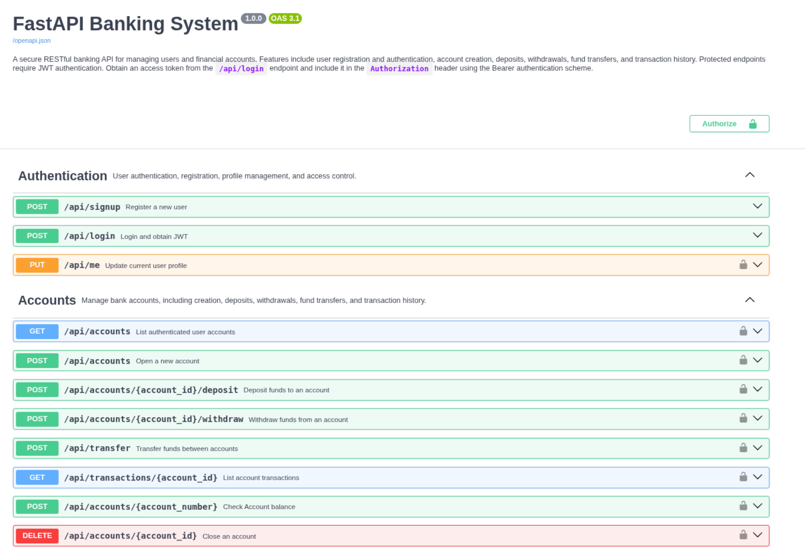
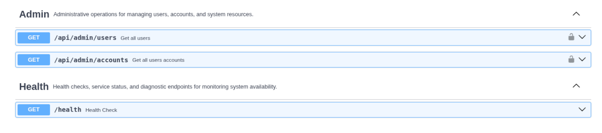
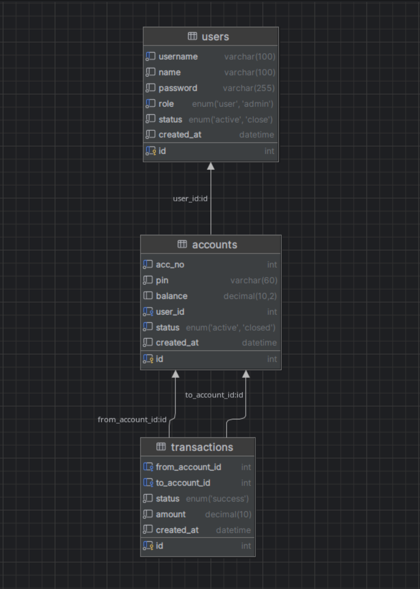

# FastAPI Banking System

A full-stack **Bank Account Management API** built with **FastAPI**, **MySQL**, and **Docker**, featuring JWT authentication, role-based access control, async database operations, transaction safety, load testing, GitHub Actions CI/CD, and VPS production deployment.

The project includes a **React + Vite frontend dashboard** for testing and interacting with the API.

---

## Highlights

- Async FastAPI architecture
- JWT Authentication & RBAC
- SQLAlchemy 2.0 Async ORM
- Redis caching
- MySQL
- Docker & Docker Compose
- Service Layer architecture
- OpenAPI documentation

# Features

*  JWT Authentication
*  Role-Based Access Control
*  Async FastAPI + Async SQLAlchemy
*  Dockerized Backend & Frontend
*  Shared MySQL & Redis Infrastructure
*  Redis Caching
*  Account Management
*  Deposit, Withdraw & Transfer System
*  Transaction Ledger
*  Admin Management
*  Health Monitoring Endpoint
*  Full Async Pytest Suite
*  k6 Load Testing & Benchmarking
*  VPS Production Deployment
*  HTTPS + Nginx Reverse Proxy
*  Rate Limiting using SlowAPI
*  GitHub Actions CI/CD

---

# Live Demo

Frontend:

```text
https://bank.dhruvcore.com/
```
---

# Preview






### Database Diagram



---


## Architecture

(Client
 ↓
FastAPI
 ↓
Service Layer
 ↓
Repository Layer
 ↓
MySQL + Redis)

> See docs/architecture.md for detailed architecture.
[Architecture](docs/architecture.md)

---

# Tech Stack

| Layer            | Technology              |
| ---------------- | ----------------------- |
| Backend          | FastAPI                 |
| Database         | MySQL                   |
| Cache            | Redis                   |
| ORM              | SQLAlchemy 2.x Async    |
| Async Driver     | aiomysql                |
| Frontend         | React + Vite            |
| Authentication   | JWT                     |
| Password Hashing | bcrypt + passlib        |
| Authorization    | RBAC                    |
| Testing          | Pytest + pytest-asyncio |
| Load Testing     | k6                      |
| Server           | Uvicorn / Gunicorn      |
| Containerization | Docker + Docker Compose |
| Reverse Proxy    | Nginx                   |
| SSL              | Certbot + Let's Encrypt |
| CI/CD            | GitHub Actions          |

---

# Project Structure

```text
.
├── backend/
│   ├── app/
│   │   ├── api/
│   │   │   └── routes/                     # FastAPI route modules
│   │   ├── core/                           # Config, security, constants, logging, exceptions
│   │   ├── db/                             # Async database session 
│   │   │   └── models/                     # SQLAlchemy models
│   │   ├── repositories/                   # Repository layer placeholders
│   │   ├── schemas/                        # Pydantic request/response schemas
│   │   ├── services/                       # Business logic modules
│   │   ├── tasks/                          # Background task placeholders
│   │   ├── tests/                          # Test placeholders
│   │   ├── websocket/                      # Realtime event and handler placeholders
│   │   │
│   │   ├── lifespan.py
│   │   └── main.py
│   │
│   └── requirements.txt
│
├── db_queries/                             # Database setup tables creation and permissions 
├── docker/                                 # Dockerfiles   
├── docs/                                   # Documentaion about project   
├── frontend/                               # Frontend
├── images/                                 # Image about project 
├── k6/                                     # Load test
├── nginx/                                  # Nginx placeholder
├── scripts/                                # Utility script
│
├──.env.example
├── docker-compose.oss.yml                  # Whole project Container
├── docker-compose.yml                      # Api Container
├── LICENSE
├── progress.md
└── README.md
```
---

## Quick Start

```text
Installation
├── Clone repository
├── Configure .env
├── Install dependencies
├── Run database
├── Run backend
└── Run frontend
```

## Clone repository

```bash
git clone https://github.com/Dhruv-Cmds/fastapi-banking-system.git

cd fastapi-banking-system
```
## Configure .env

```
cp .env.example .env
```

## Create Virtual Environment

```bash
python -m venv .venv
```

### Windows

```bash
.venv\Scripts\activate
```

### Linux / macOS

```bash
source .venv/bin/activate
```

## Install Dependencies

```bash
pip install -r requirements.txt
```

## Run Backend

```bash
uvicorn app.main:app --reload --port 8000
```

## Run Frontend

```bash
cd frontend

npm install

npm run dev
```

# 🔐 Authentication

Protected routes require:

```text
Authorization: Bearer <your_token>
```

## JWT Authentication Example

```bash
curl -X POST http://127.0.0.1:8000/api/login \
  -H "Content-Type: application/json" \
  -d '{"username":"admin","password":"admin123"}'
```

```bash
curl http://127.0.0.1:8000/api/accounts \
  -H "Authorization: Bearer <ACCESS_TOKEN>"
```
---

## API Documentation

Swagger Docs:

```text
http://127.0.0.1:8000/docs
```

ReDoc:

```text
http://127.0.0.1:8000/redoc
```

# 📘 Swagger OpenAPI Notes

* Protected routes use `Authorization: Bearer <token>`.
* `/api/signup` and `/api/login` are public.
* `/api/accounts`, `/api/transfer`, `/api/transactions/{account_id}` and account operations require a valid JWT.
* Example request bodies are shown in Swagger UI under each endpoint.

---

# 🌐 Frontend

A frontend is included using:

* React
* Vite
* JavaScript

## Frontend Features

* Signup & Login
* Create Accounts
* Deposit Money
* Withdraw Money
* Transfer Money
* View Transaction History
* JWT Protected API Calls

> This frontend is an API interaction dashboard, not a full production banking UI.

---

# Critical Issues Fixed

* Fixed Windows event loop issues
* Eliminated cross-loop DB errors
* Added per-test engine isolation
* Fixed connection leaks


# Documentation

Detailed documentation is available in the `docs/` directory.

| Document | Description |
|----------|-------------|
| [Architecture](docs/architecture.md) | System architecture, service layers, domain model, and core modules. |
| [Docker](docs/docker.md) | Docker workflows, shared infrastructure, and local development. |
| [Deployment](docs/deployment.md) | VPS deployment, CI/CD pipeline, and production infrastructure. |
| [Security](docs/security.md) | Authentication, authorization, validation, and production security. |
| [Testing](docs/testing.md) | Test environment, async testing, Docker testing, and CI. |
| [Load Testing](docs/load-testing.md) | Benchmark methodology and load testing results. |
| [Performance](docs/performance.md) | Performance analysis, bottlenecks, scalability, and future improvements. |


# 📌 License

This project is intended for educational and portfolio purposes.

See LICENSE for details.the [LICENSE](LICENSE) file for details.