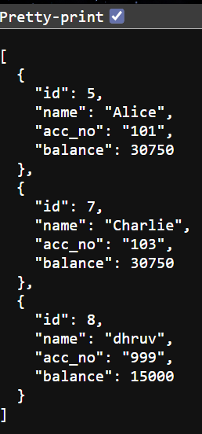

# 🏦 FastAPI Banking System

A production-style **Bank Account Management API** built with **FastAPI**, **SQLAlchemy**, and **MySQL**.

Designed to simulate real-world fintech backend systems with secure authentication, transactional integrity, and clean architecture.

---

## 🖼️ UI Preview

  


---

## 🌐 Live Demo

- Frontend: https://fastapi-banking-system.vercel.app
- Backend API: https://fastapi-banking-system.onrender.com
- API Docs: https://fastapi-banking-system.onrender.com/docs

## 🚀 Key Features

### 🔐 Authentication
- JWT-based authentication
- Secure password hashing (bcrypt)
- Case-insensitive username handling

---

### 🏦 Account Management
- Create and manage multiple accounts
- Unique account number enforcement
- Fetch all accounts for a user

---

### 💸 Transactions
- Deposit funds
- Withdraw funds with balance validation
- Transfer money between accounts
- Prevent self-transfers
- Concurrency-safe operations using DB row locking

---

### 🧠 Validation & Business Logic
- Amount must be greater than zero
- Cannot withdraw beyond balance
- Prevent duplicate account numbers
- Backend-driven validation (no trust in frontend)

---

## 🧱 Tech Stack

| Layer        | Technology |
|-------------|-----------|
| Backend      | FastAPI |
| ORM          | SQLAlchemy |
| Database     | MySQL |
| Validation   | Pydantic |
| Auth         | JWT (python-jose) |
| Security     | Passlib (bcrypt) |
| Config       | python-dotenv |

---

## 📁 Project Structure

```
fastapi-banking-system/
│
├── app/
│ ├── routes/ # API endpoints (auth, accounts)
│ ├── models/ # Database models
│ ├── schemas/ # Request/response validation
│ ├── db/ # DB connection setup
│ ├── core/ # Security (JWT, hashing)
│ └── dependencies/ # Auth middleware
│
├── main.py # Application entry point
├── requirements.txt
├── .env # Environment variables (excluded)
└── .gitignore
```

# ⚙️ Setup Guide

## 1️⃣ Clone Repository

```bash
git clone https://github.com/Dhruv-Cmds/fastapi-banking-system.git
cd fastapi-banking-system
```

## 2️⃣ Create Virtual Environment

```bash
python -m venv .venv
```

### Activate:

**Windows**

```bash
.venv\Scripts\activate
```

**Mac/Linux**

```bash
source .venv/bin/activate
```

## 3️⃣ Install Dependencies

```bash
pip install -r requirements.txt
```

## 4️⃣ Configure Environment

Create a `.env` file:

```env
DB_USER=root
DB_PASSWORD=your_password
DB_HOST=localhost
DB_NAME=bankaccountsystem

SECRET_KEY=your_secret_key
ALGORITHM=HS256
```

## 5️⃣ Run Server

```bash
uvicorn main:app --reload
```

---

# 📌 API Endpoints

## 🔐 Auth

* `POST /signup`
* `POST /login`

## 🏦 Accounts

* `POST /accounts`
* `GET  /accounts`

## 💰 Transactions

* `POST /accounts/{id}/deposit`
* `POST /accounts/{id}/withdraw`
* `POST /transfer`

---

# 🧠 System Behavior

* Tables auto-created at startup:

  ```python
  Base.metadata.create_all(bind=engine)
  ```
* Schema driven by SQLAlchemy models
* Fully RESTful API design

---

# 🔐 Security Highlights

* JWT authentication
* Password hashing (bcrypt)
* Environment-based secrets
* Protected routes with dependency injection
* Safe transaction handling using DB locks

---

# 💎 Highlights

* Clean, modular architecture
* Real-world banking logic implementation
* Transaction safety (race-condition prevention)
* Scalable backend design
* Production-ready structure

---

# 🏁 Conclusion

This project demonstrates how to build a real-world backend system with:

* Authentication & authorization
* Database design & ORM usage
* Transaction safety & concurrency handling
* Clean architecture & scalability

It serves as a strong foundation for evolving into a full fintech platform 🚀

---

# ⭐ Author

**Dhruv**
Built with focus on backend engineering & system design.
