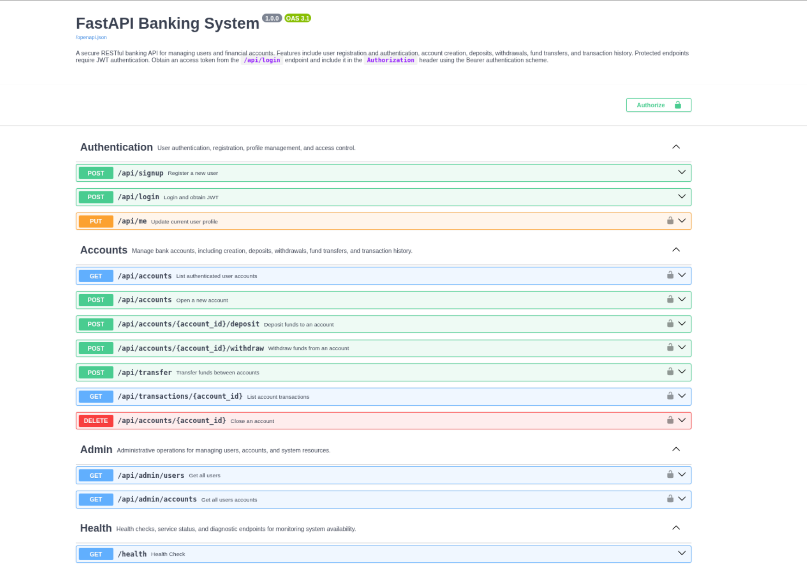

# 🏦 FastAPI Banking System

A full-stack **Bank Account Management API** built with **FastAPI**, **MySQL**, and **Docker**, featuring JWT authentication, role-based access control, async database operations, transaction safety, load testing, GitHub Actions CI/CD, and VPS production deployment.

The project includes a **React + Vite frontend dashboard** for testing and interacting with the API.

---

# 🚀 Features

*  JWT Authentication
*  Role-Based Access Control
*  Async FastAPI + Async SQLAlchemy
*  Dockerized Backend & Frontend
*  Shared MySQL & Redis Infrastructure
*  Redis Caching
*  Account Management
*  Deposit, Withdraw & Transfer System
*  Transaction Ledger
*  Admin Management
*  Health Monitoring Endpoint
*  Full Async Pytest Suite
*  k6 Load Testing & Benchmarking
*  VPS Production Deployment
*  HTTPS + Nginx Reverse Proxy
*  Rate Limiting using SlowAPI
*  GitHub Actions CI/CD

---

# 🌐 Live Demo

Frontend:

```text
https://bank.dhruvcore.com/
```

---

# 📸 Preview




---

# 🏗️ Tech Stack

| Layer            | Technology              |
| ---------------- | ----------------------- |
| Backend          | FastAPI                 |
| Database         | MySQL                   |
| Cache            | Redis                   |
| ORM              | SQLAlchemy 2.x Async    |
| Async Driver     | aiomysql                |
| Frontend         | React + Vite            |
| Authentication   | JWT                     |
| Password Hashing | bcrypt + passlib        |
| Authorization    | RBAC                    |
| Testing          | Pytest + pytest-asyncio |
| Load Testing     | k6                      |
| Server           | Uvicorn / Gunicorn      |
| Containerization | Docker + Docker Compose |
| Reverse Proxy    | Nginx                   |
| SSL              | Certbot + Let's Encrypt |
| CI/CD            | GitHub Actions          |

---

# 🌐 Frontend Dashboard

A frontend dashboard is included using:

* React
* Vite
* JavaScript

## Frontend Features

* Signup & Login
* Create Accounts
* Deposit Money
* Withdraw Money
* Transfer Money
* View Transaction History
* JWT Protected API Calls

> This frontend is an API interaction dashboard, not a full production banking UI.

---

# 🧠 Architecture Highlights

* Layered service architecture
* Async-first backend design
* Config-driven business rules
* Shared Docker infrastructure
* Redis-backed caching layer
* CI tested with GitHub Actions
* Nginx reverse proxy deployment
* Production-ready VPS infrastructure
* JWT + RBAC secured architecture

---

# 🏗️ Development Modes

This project supports two Docker workflows.

### Shared Infrastructure (Recommended)

Uses the separate `docker-infra` repository to provide shared MySQL and Redis services for multiple projects.

### Standalone Docker

Uses `docker-compose.oss.yml` to run MySQL, Redis, the API, and the frontend from this repository only.

---


# 🧠 Core Modules

## 🔐 Authentication

* JWT-based signup/login
* Password hashing with bcrypt
* Protected routes
* RBAC authorization system

## 🏦 Account Management

* Multiple accounts per user
* Unique account numbers
* Initial balance set to 0
* Fetch all user accounts

## 🔄 Account Lifecycle

```text
ACTIVE → usable
CLOSED → blocked
```

Implements soft-close account behavior similar to real banking systems.

## 💸 Transactions

* Deposit
* Withdraw
* Transfer

## 👑 Admin Features

* View all users
* View all accounts
* Close accounts
* RBAC-protected admin routes

---


# 🛡️ Safety & Integrity

* Prevents negative balances
* Prevents self-transfer
* Allows only ACTIVE accounts
* Atomic database transactions using commit/rollback
* JWT-secured endpoints
* HTTPS encryption in production

---

# 🧾 Transaction Ledger

Every transaction is recorded for:

* Auditing
* Analytics
* Fraud detection foundations

---

# 🧠 Business Rules

* Deposit limits
* Withdraw limits
* Transfer limits
* Config-driven validation rules

---

# 📁 Project Structure

```text
.
├── backend/
│   ├── app/
│   │   ├── api/
│   │   │   └── routes/                     # FastAPI route modules
│   │   ├── core/                           # Config, security, constants, logging, exceptions
│   │   ├── db/                             # Async database session 
│   │   │   └── models/                     # SQLAlchemy models
│   │   ├── repositories/                   # Repository layer placeholders
│   │   ├── schemas/                        # Pydantic request/response schemas
│   │   ├── services/                       # Business logic modules
│   │   ├── tasks/                          # Background task placeholders
│   │   ├── tests/                          # Test placeholders
│   │   ├── websocket/                      # Realtime event and handler placeholders
│   │   │
│   │   ├── lifespan.py
│   │   └── main.py
│   │
│   └── requirements.txt
│
├── db_quires/                              # Database setup tables creation and permissions 
├── docker/                                 # Dockerfiles   
├── frontend/                               # Frontend
├── image/                                  # Image about project 
├── k6/                                     # Load test
├── nginx/                                  # Nginx placeholder
├── scripts/                                # Utility script
│
├──.env.example
├── docker-compose.oss.yml                  # Whole project Container
├── docker-compose.yml                      # Api Container
├── LICENSE
├── progress.md
└── README.md
```

---

# ⚙️ Environment Variables

## 🏗️ Shared Infrastructure (Recommended)

Use this configuration if you're running the separate `docker-infra` repository.

```env
ENV=docker

DB_HOST=shared-mysql
DB_PORT=3306
DB_NAME=banking
DB_USER=banking_user
DB_PASSWORD=banking_password

REDIS_HOST=shared-redis
REDIS_PORT=6379
REDIS_DB=0

ADMIN_USERNAME=admin
ADMIN_PASSWORD=change_me

SECRET_KEY=change_me
ALGORITHM=HS256
ACCESS_TOKEN_EXPIRE_MINUTES=30
```

> Requires the `docker-infra` repository to be running.
**repo**: https://github.com/Dhruv-Cmds/docker-infra
---

## 🐳 Standalone Docker (Open Source)

Use this configuration when running the project with `docker-compose.oss.yml`.

```env
ENV=docker

DB_HOST=mysql
DB_PORT=3306
DB_NAME=banking
DB_USER=banking_user
DB_PASSWORD=banking_password

REDIS_HOST=redis
REDIS_PORT=6379
REDIS_DB=0

ADMIN_USERNAME=admin
ADMIN_PASSWORD=change_me

SECRET_KEY=change_me
ALGORITHM=HS256
ACCESS_TOKEN_EXPIRE_MINUTES=30
```

> Works without the `docker-infra` repository.
**repo**: https://github.com/Dhruv-Cmds/docker-infra

## 💻 Local Development (Without Docker)

```env
ENV=dev

DB_HOST=127.0.0.1
DB_PORT=3306
DB_NAME=banking
DB_USER=banking_user
DB_PASSWORD=your_password

REDIS_HOST=127.0.0.1
REDIS_PORT=6379
REDIS_DB=0

SECRET_KEY=your_secret_key
ALGORITHM=HS256
ACCESS_TOKEN_EXPIRE_MINUTES=30
```

---

## 🧪 Testing

```env
ENV=test

DB_HOST=127.0.0.1
DB_PORT=3306

DB_NAME=banking_test
DB_USER=banking_user
DB_PASSWORD=your_password

REDIS_HOST=127.0.0.1
REDIS_PORT=6379
REDIS_DB=1

SECRET_KEY=your_secret_key
ALGORITHM=HS256
ACCESS_TOKEN_EXPIRE_MINUTES=30
```

---

# ⚙️ Local Setup

## Create Virtual Environment

```bash
python -m venv .venv
```

### Windows

```bash
.venv\Scripts\activate
```

### Linux / macOS

```bash
source .venv/bin/activate
```

## Install Dependencies

```bash
pip install -r requirements.txt
```

## Run Backend

```bash
uvicorn app.main:app --reload --port 8000
```

Swagger Docs:

```text
http://127.0.0.1:8000/docs
```

ReDoc:

```text
http://127.0.0.1:8000/redoc
```

---

# 🔐 Authentication

Protected routes require:

```text
Authorization: Bearer <your_token>
```

## JWT Authentication Example

```bash
curl -X POST http://127.0.0.1:8000/api/login \
  -H "Content-Type: application/json" \
  -d '{"username":"admin","password":"admin123"}'
```

```bash
curl http://127.0.0.1:8000/api/accounts \
  -H "Authorization: Bearer <ACCESS_TOKEN>"
```

---

# 📘 Swagger OpenAPI Notes

* Protected routes use `Authorization: Bearer <token>`.
* `/api/signup` and `/api/login` are public.
* `/api/accounts`, `/api/transfer`, `/api/transactions/{account_id}` and account operations require a valid JWT.
* Example request bodies are shown in Swagger UI under each endpoint.

---

# ✅ Acceptance Criteria

* Swagger/OpenAPI docs show JWT authentication instructions and `Authorize` support.
* Every endpoint includes a clear summary and description.
* Example request bodies are available for signup, login, account creation, deposit, withdraw, and transfer.
* Protected endpoints require a Bearer token and are grouped under `Authentication` / `Accounts` tags.
* Developer onboarding covers local startup, docs, and sample auth requests.

---

# 🌐 VPS Production Deployment

This project is deployed on a Linux VPS using Docker, Nginx, HTTPS, GitHub Actions, and a production-style reverse proxy setup.

## Infrastructure

* Hostinger VPS
* Ubuntu 24.04
* Dockerized FastAPI backend
* Dockerized React frontend
* Shared Docker MySQL
* Shared Docker Redis
* Nginx reverse proxy
* HTTPS enabled with Certbot + Let's Encrypt
* GitHub Actions CI/CD

## Production Stack

### Backend

* FastAPI
* Async SQLAlchemy
* JWT Authentication
* RBAC authorization
* Dockerized API container

### Frontend

* React + Vite
* Dockerized frontend container
* Nginx reverse proxy integration

### Database

* Database & Cache

* MySQL 8
* Redis 7
* Shared infrastructure
* Persistent Docker volumes

## Production Security

* Swagger/OpenAPI disabled in production
* HTTPS enforced
* SSH key authentication
* UFW firewall configured
* JWT authentication
* bcrypt password hashing
* Nginx reverse proxy isolation
* Rate limiting using SlowAPI
* Public access is limited to the deployed frontend only.
* OpenAPI docs, database access, and internal production controls are blocked from public access.
* Production changes require codebase access or VPS-level access.

## Deployment Flow

```text
git push origin main
        ↓
GitHub Actions
        ↓
SSH into VPS
        ↓
git pull
        ↓
docker compose up --build -d
```

---

# 🐳 Docker Setup

## Option 1: Shared Infrastructure (Recommended)

Start the shared services first:

```bash
cd docker-infra
docker compose up -d
```

Then start the application:

```bash
cd fastapi-banking-system
docker compose up --build
```

This setup uses the shared MySQL and Redis containers.

---

## Option 2: Standalone Docker (Open Source)

If you don't want to use the shared infrastructure repository, run:

```bash
docker compose -f docker-compose.oss.yml up --build
```

This starts:

* MySQL
* Redis
* Banking API
* Banking Frontend

Everything runs from a single repository.

---

## Reset Database

### Shared Infrastructure

```bash
cd docker-infra
docker compose down -v
```

> This removes **all shared MySQL and Redis data** used by every project.

### Standalone Docker

```bash
docker compose -f docker-compose.oss.yml down -v
```

> This removes only this project's database and Redis data.

---

## Running Tests

### Shared Infrastructure

Tests connect to:

```text
shared-mysql:3306
shared-redis:6379
```

### Standalone Docker

Tests connect to:

```text
mysql:3306
redis:6379
```

The application selects the correct host based on the environment configuration.

---

# 🧪 Testing

## Run Tests

### Local Development

Run the test suite from the project root:

```bash
export ENV=test

python -m pytest -v
```

---

### Inside Docker (Shared Infrastructure)

```bash
docker exec -it banking-api bash

export ENV=docker

python -m pytest -v
```

The tests will connect to:

```text
shared-mysql:3306
```

---

### Inside Docker (Standalone)

```bash
docker compose -f docker-compose.oss.yml exec banking-api bash

export ENV=docker

python -m pytest -v
```

The tests will connect to:

```text
mysql:3306
```

## Test Coverage Includes

* MySQL-based testing
* Per-test database reset
* Async-safe fixtures
* Dependency overrides
* JWT authentication
* RBAC authorization
* Account creation
* Deposits
* Withdrawals
* Transfers
* Transaction history
* Admin endpoints

---

# ⚙️ Async Fixes

## Critical Issues Fixed

* Fixed Windows event loop issues
* Eliminated cross-loop DB errors
* Added per-test engine isolation
* Fixed connection leaks

---

# 🚀 Performance & Load Testing

The API was stress-tested using **k6** against production-style environments:

* FastAPI running in Docker
* MySQL running in Docker
* Async SQLAlchemy + aiomysql
* JWT Authentication
* bcrypt password hashing
* Rate limiting enabled
* Mixed authenticated banking workloads

## Run Load Test

```bash
k6 / load_test.js
```

## Run Full Test

```bash
k6/ full_test.js
```

---

# 📈 Load Testing Results

| Test                          | Virtual Users | Duration | Requests/sec | Result |
| ----------------------------- | ------------- | -------- | ------------ | ------ |
| Linux VPS Production Test     | 500 VUs       | 60s      | ~534 req/s   | Services remained operational |
| Banking Workflow Load Test    | 500 VUs       | 60s      | ~534 req/s   | 111k+ HTTP requests processed |
| Sustained Banking Sessions    | 500 VUs       | 60s      | Stable under moderate traffic | No catastrophic crashes |
| Transaction Workflow Test     | 500 VUs       | 60s      | Included Above | Deposits, withdrawals, transfers completed |

---

# ⚡ Scaling Behavior

| Concurrent Users | System Behavior                                      |
| ---------------- | ---------------------------------------------------- |
| 1–200 Users      | Stable with healthy response times                   |
| 200–300 Users    | Stable under moderate authenticated traffic          |
| 300–500 Users    | Stress range with higher latency and rate limiting   |
| 500+ Users       | Overload behavior begins appearing                   |

---

# 🐧 Linux VPS Production Testing

## VPS Specifications

* 2 vCPU
* 8GB RAM
* Ubuntu 24.04
* Dockerized environment

## Tested Workflows

* Signup
* Login
* Account creation
* Deposits
* Withdrawals
* Transfers
* Transaction history
* Profile updates
* Account deletion
* Admin endpoints

## Production Results

* ~534 requests/sec observed
* 111k+ HTTP requests processed
* 55k+ iterations completed

## Stable Range

* ~100–300 realistic concurrent active users

## Stress Range

* ~300–500 concurrent virtual users

## Overload Behavior

At aggressive loads beyond 500 concurrent VUs:

* Increased latency observed
* High 429 rate limiting responses
* No catastrophic crashes
* Services remained operational

---

# 🧠 Bottleneck Analysis

| Bottleneck                   | Cause                                             |
| ---------------------------- | ------------------------------------------------- |
| bcrypt hashing               | CPU-intensive password hashing during auth flows  |
| MySQL connection pool limits | Limited database connections under concurrency    |
| Single MySQL container       | Single-node database write pressure               |
| Request queueing delays      | High concurrent traffic waiting for workers       |
| Rate limiting                | Auth-heavy traffic triggering 429 responses       |

---

# 🔧 Optimizations Applied

* Async database engine
* Connection pooling
* Rate limiting
* Docker networking fixes
* Removed SQLite fallback
* MySQL-only architecture
* Redis caching enabled
* HTTPS production deployment
* Nginx reverse proxy
* JWT authentication
* RBAC admin authorization
* GitHub Actions CI/CD pipeline

---

# 🏗️ Stability Summary

| Metric                          | Result                         |
| ------------------------------- | ------------------------------ |
| Requests/sec Observed           | ~534 req/s                     |
| Total HTTP Requests Processed   | 111k+                          |
| Iterations Completed            | 55k+                           |
| Maximum Concurrent VUs Survived | 500                            |
| Catastrophic Crashes            | 0                              |
| Container Stability             | Services remained operational  |

---

# 🏁 Final Status

* ✅ Fully functional backend
* ✅ Dockerized full-stack environment
* ✅ MySQL-only architecture
* ✅ HTTPS production deployment
* ✅ JWT-secured API
* ✅ RBAC admin authorization
* ✅ CI/CD operational
* ✅ VPS secured and hardened
* ✅ All tests passing
* ✅ Load tested in live VPS environment
* ✅ Stable under moderate concurrent traffic
* ✅ Survived 500 concurrent k6 virtual users without total service collapse

Stable behavior observed around ~300 concurrent users.

---

# 🚀 Future Improvements

* Increase worker processes
* Add background task queues
* Implement load balancing
* Enable horizontal scaling
* Add observability stack with Grafana and Prometheus
* Add database replication

---

# 🎯 Capacity Summary

* ~200–300 concurrent users on Docker Desktop Windows
* ~300–500 concurrent users on Linux VPS environments

---

# 🧠 Key Learnings

* Managing async DB connections under load
* Debugging connection pool exhaustion
* Understanding infrastructure bottlenecks using k6
* Comparing Windows vs Docker vs Linux performance
* Deploying secure Dockerized applications on VPS infrastructure
* Production hardening using Nginx, HTTPS, and firewalls

---

# ⚠️ Limitations

* Single instance deployment
* Single Redis instance
* No Redis Sentinel/Cluster
* Performance constrained by MySQL connection pool
* No horizontal scaling yet

---

# 📌 License

This project is intended for educational and portfolio purposes.